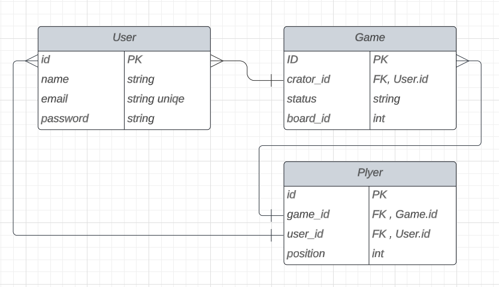

# docs

GPT_LINK: <https://chat.openai.com/share/f97f5a3c-b4fc-4411-b560-f7ad6846eca6>

Schema: <https://lucid.app/lucidchart/3b81569b-b937-49cf-8cfa-7e3ba02b3a89/edit?viewport_loc=325%2C216%2C1171%2C711%2C0_0&invitationId=inv_13931817-4b47-496a-a92c-811cb6bad3ec>

## Classes

1. **User**
    - Methods:
        - **`register(username: string, password: string): void`**
        - **`login(username: string, password: string): User`**
2. **Game**
    - Methods:
        - **`createGame(creator: User): Game`**
        - **`joinGame(game: Game, user: User): void`**
        - **`startGame(game: Game): void`**
        - **`getPlayers(game: Game): Player[]`**
        - **`endGame(game: Game): void`**
        - **`getGameStatus(game: Game): string`**
3. **Player**
    - Methods:
        - **`movePlayer(player: Player, rollValue: int): void`**
        - **`getCurrentPosition(player: Player): int`**

## UML Diagram

